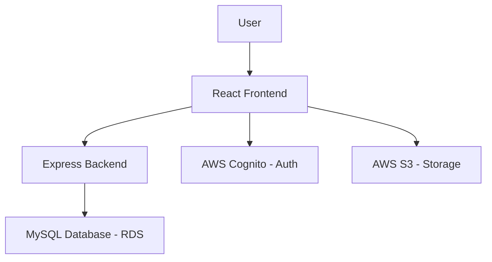

# Placify 🎓💼

**Campus Placement Management System**

[](https://aws.amazon.com/amplify/)
[](https://reactjs.org/)
[](https://expressjs.com/)
[](https://mysql.com/)

Placify is a comprehensive campus placement management system designed to help students prepare for job interviews through shared experiences. By creating a community-driven knowledge base of real interview experiences, Placify empowers students with insights into company recruitment processes, technical questions, and valuable tips.

## 🌟 Features

### Core Functionality
- **User Authentication**: Secure sign-up and login system
- **Experience Sharing**: Submit detailed interview experiences with company information
- **Experience Browsing**: View and search interview experiences shared by other students
- **File Uploads**: Attach supporting documents to interview experiences
- **Dashboard Analytics**: Visualize placement statistics and trends

### AWS Services Integration
- **AWS Amplify**: Frontend hosting and backend orchestration
- **Amazon Cognito**: User authentication and management
- **Amazon S3**: File storage for supporting documents
- **Amazon EC2**: Compute resources for backend server
- **Amazon RDS**: Managed MySQL database for structured data

## 🏗️ Architecture



### Frontend
- **React 19** with **Vite** for fast development
- **Tailwind CSS** for responsive UI design
- **Recharts** for data visualization
- **React Router** for navigation
- **AWS Amplify UI** for authentication components

### Backend
- **Express.js** server with REST API endpoints
- **MySQL** database for storing interview experiences
- **CORS** enabled for cross-origin requests
- Environment-based configuration

## 🚀 Getting Started

### Prerequisites
- Node.js (v18 or higher)
- npm (v9 or higher)
- AWS Account with appropriate permissions

### Installation

1. **Clone the repository**
   ```bash
   git clone https://github.com/gallant-giri/placify.git
   cd placify
   ```

2. **Install frontend dependencies**
   ```bash
   npm install
   ```

3. **Install backend dependencies**
   ```bash
   cd backend
   npm install
   cd ..
   ```

### AWS Setup

1. **Install Amplify CLI**
   ```bash
   npm install -g @aws-amplify/cli
   ```

2. **Configure AWS credentials**
   ```bash
   amplify configure
   ```

3. **Initialize Amplify project**
   ```bash
   amplify init
   ```

4. **Add authentication**
   ```bash
   amplify add auth
   ```

5. **Add storage**
   ```bash
   amplify add storage
   ```

6. **Deploy AWS resources**
   ```bash
   amplify push
   ```

### Database Setup

1. **Create RDS MySQL instance**
   - Navigate to AWS RDS console
   - Create a MySQL database instance
   - Configure security groups to allow inbound connections on port 3306

2. **Create database schema**
   ```sql
   CREATE DATABASE IF NOT EXISTS placify;
   USE placify;
   
   CREATE TABLE experiences (
     id INT AUTO_INCREMENT PRIMARY KEY,
     user_id VARCHAR(255),
     company VARCHAR(255),
     role VARCHAR(255),
     description TEXT,
     file_key VARCHAR(512),
     created_at TIMESTAMP DEFAULT CURRENT_TIMESTAMP
   );
   ```

### Environment Configuration

1. **Frontend `.env` file**
   ```env
   VITE_API_BASE_URL=http://your-ec2-instance-url:4000
   ```

2. **Backend `.env` file**
   ```env
   DB_HOST=your-rds-endpoint.amazonaws.com
   DB_USER=your-db-username
   DB_PASSWORD=your-db-password
   DB_NAME=placify
   PORT=4000
   ```

### Running the Application

1. **Start the backend server**
   ```bash
   cd backend
   npm start
   # or for development
   npm run dev
   ```

2. **Start the frontend application**
   ```bash
   npm run dev
   ```

3. **Build for production**
   ```bash
   npm run build
   ```

## 📊 Dashboard Overview

The dashboard provides valuable insights into campus placement trends:
- Monthly placement statistics
- Industry-wise placement distribution
- Weekly interview trends
- Skill demand analysis

## 🔐 Security

- User authentication via Amazon Cognito
- Secure file storage in private S3 buckets
- HTTPS encryption for all communications
- CORS policies to prevent unauthorized access

## 🛠️ Technologies Used

| Category | Technology |
|---------|------------|
| Frontend | React, Vite, Tailwind CSS, Recharts |
| Backend | Express.js, Node.js |
| Database | MySQL (RDS) |
| Authentication | AWS Cognito |
| Storage | AWS S3 |
| Hosting | AWS Amplify |

## 📚 Contributing

1. Fork the repository
2. Create your feature branch (`git checkout -b feature/AmazingFeature`)
3. Commit your changes (`git commit -m 'Add some AmazingFeature'`)
4. Push to the branch (`git push origin feature/AmazingFeature`)
5. Open a pull request

## 📞 Support

For support, email [your-email] or create an issue in the repository.

## 📄 License

This project is licensed under the MIT License - see the `LICENSE` file for details.

---

<p align="center">
  Made with ❤️ for students preparing for campus placements
</p>
